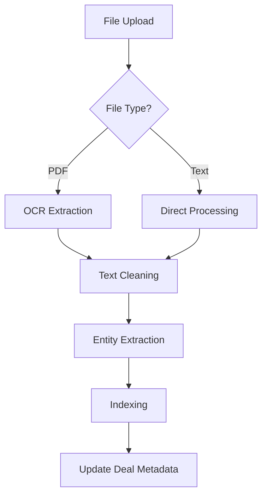
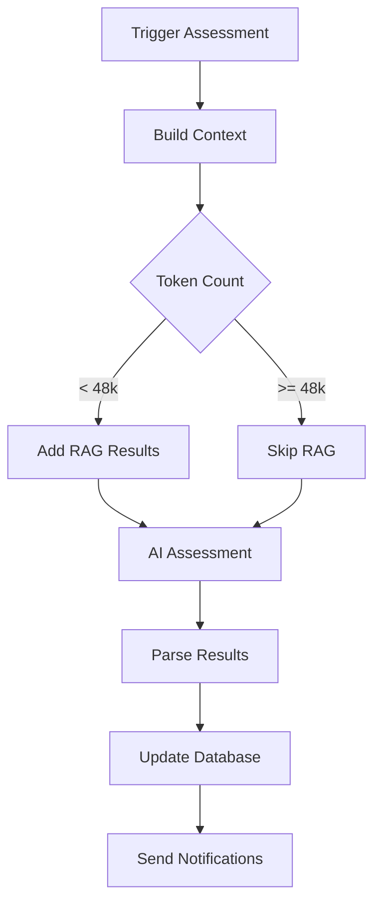

# Processing Pipelines Specification

## Overview
This document specifies the automated processing pipelines for the Deal Management System, including OCR, text cleaning, assessment automation, and data enrichment.

---

## 1. File Processing Pipeline

### Trigger
Automatically triggered when a new file is uploaded to a deal

### Pipeline Flow


### 1.1 OCR Extraction
```python
# brain/apps/deals/tasks.py
@shared_task(bind=True, max_retries=3)
def extract_text_from_file(self, file_uuid):
    """Extract text from uploaded file"""
    try:
        file_obj = DealFile.objects.get(uuid=file_uuid)
        
        # Update status
        file_obj.processing_status = ProcessingStatus.PROCESSING
        file_obj.save()
        
        # Extract based on file type
        if file_obj.file_type == 'application/pdf':
            text = extract_pdf_text(file_obj.file.path)
        elif file_obj.file_type.startswith('image/'):
            text = extract_image_text(file_obj.file.path)  # OCR
        else:
            text = extract_plain_text(file_obj.file.path)
        
        # Save raw text
        file_obj.raw_text = text
        file_obj.raw_text_extracted_at = timezone.now()
        file_obj.processing_status = ProcessingStatus.TEXT_EXTRACTED
        file_obj.save()
        
        # Trigger next step
        clean_file_text.delay(file_uuid)
        
    except Exception as e:
        file_obj.processing_status = ProcessingStatus.FAILED
        file_obj.processing_error = str(e)
        file_obj.save()
        raise self.retry(exc=e, countdown=60)
```

### 1.2 Text Cleaning Rules
```python
@shared_task
def clean_file_text(file_uuid):
    """Clean and optimize extracted text"""
    file_obj = DealFile.objects.get(uuid=file_uuid)
    raw_text = file_obj.raw_text
    
    # Determine cleaning strategy
    token_count = count_tokens(raw_text)
    
    if file_obj.category == 'deck' and token_count > 5000:
        # Aggressive cleaning for pitch decks
        cleaned = clean_pitch_deck(raw_text)
    elif file_obj.category == 'paper':
        # Preserve academic content
        cleaned = clean_academic_paper(raw_text)
    else:
        # Standard cleaning
        cleaned = standard_clean(raw_text)
    
    # Save cleaned text
    file_obj.cleaned_text = cleaned
    file_obj.cleaned_text_tokens = count_tokens(cleaned)
    file_obj.processing_status = ProcessingStatus.CLEANED
    file_obj.save()
    
    # Trigger entity extraction
    extract_entities.delay(file_uuid)

def clean_pitch_deck(text):
    """Aggressive cleaning for pitch decks"""
    # Remove boilerplate
    text = remove_disclaimers(text)
    text = remove_headers_footers(text)
    
    # Compress redundant content
    text = compress_bullet_points(text)
    text = summarize_verbose_sections(text)
    
    # Target: Reduce by 60-70%
    return text

def clean_academic_paper(text):
    """Preserve important academic content"""
    # Keep abstract, methodology, results
    # Remove references, acknowledgments
    # Summarize literature review
    return text
```

### 1.3 Entity Extraction
```python
@shared_task
def extract_entities(file_uuid):
    """Extract company facts and metadata"""
    file_obj = DealFile.objects.get(uuid=file_uuid)
    deal = file_obj.deal
    
    # Use AI to extract entities
    from aindex.vertexai import EntityExtractor
    extractor = EntityExtractor()
    
    entities = extractor.extract({
        'text': file_obj.cleaned_text,
        'type': file_obj.category
    })
    
    # Update deal/company with extracted data
    if entities.get('company_name') and not deal.company.name:
        deal.company.name = entities['company_name']
    
    if entities.get('website') and not deal.company.website:
        deal.company.website = entities['website']
    
    if entities.get('founders'):
        for founder_data in entities['founders']:
            Founder.objects.get_or_create(
                company=deal.company,
                defaults=founder_data
            )
    
    # Extract dual-use signals
    if entities.get('dual_use_signals'):
        for signal in entities['dual_use_signals']:
            DualUseSignal.objects.create(
                deal=deal,
                category=signal['category'],
                description=signal['description'],
                confidence=signal['confidence']
            )
    
    deal.company.save()
    file_obj.processing_status = ProcessingStatus.COMPLETED
    file_obj.save()
```

---

## 2. Assessment Automation Pipeline

### Trigger
- Manual via "Reassess" button
- Automatic when new files added
- Scheduled (daily for active deals)

### Pipeline Flow


### 2.1 Context Builder
```python
def build_assessment_context(deal, max_tokens=50000):
    """Build context for assessment with token budget"""
    context_parts = []
    current_tokens = 0
    
    # Priority order for context
    priority_sources = [
        ('previous_assessment', get_previous_assessment_delta),
        ('pitch_deck', get_cleaned_deck_text),
        ('affinity_notes', get_affinity_notes),
        ('research_analysis', get_research_agent_output),
        ('founders', get_founders_data),
        ('grants', get_grants_summary),
        ('patents', get_patents_summary),
        ('clinical_trials', get_clinical_trials),
        ('other_files', get_other_files_text)
    ]
    
    for source_name, source_func in priority_sources:
        source_text = source_func(deal)
        source_tokens = count_tokens(source_text)
        
        if current_tokens + source_tokens <= max_tokens:
            context_parts.append(f"=== {source_name.upper()} ===\n{source_text}")
            current_tokens += source_tokens
        else:
            # Truncate if needed
            remaining = max_tokens - current_tokens
            if remaining > 1000:  # Only add if meaningful
                truncated = truncate_to_tokens(source_text, remaining)
                context_parts.append(f"=== {source_name.upper()} (TRUNCATED) ===\n{truncated}")
            break
    
    return '\n\n'.join(context_parts), current_tokens
```

### 2.2 RAG Integration
```python
def apply_rag_enhancement(deal, context, budget_tokens):
    """Apply RAG search if budget allows"""
    if budget_tokens < 2000:
        return ""
    
    # Get search queries from Research Agent
    research_analysis = deal.research_analyses.first()
    if not research_analysis:
        return ""
    
    search_queries = research_analysis.search_queries[:3]
    
    # Run vector search
    from brain.apps.library.search import vector_search
    results = []
    
    for query in search_queries:
        query_results = vector_search(
            query=query,
            limit=10,
            min_similarity=0.7
        )
        results.extend(query_results)
    
    # Deduplicate and rank by relevance
    unique_results = deduplicate_by_content(results)
    ranked_results = rank_by_relevance(unique_results, deal)
    
    # Build RAG context within budget
    rag_context = []
    used_tokens = 0
    
    for result in ranked_results:
        result_tokens = count_tokens(result.text)
        if used_tokens + result_tokens <= budget_tokens:
            rag_context.append(f"[{result.source}]: {result.text}")
            used_tokens += result_tokens
        else:
            break
    
    return '\n'.join(rag_context)
```

### 2.3 Assessment Execution
```python
@shared_task
def assess_deal(deal_uuid):
    """Run automated assessment"""
    deal = Deal.objects.get(uuid=deal_uuid)
    
    # Check if recent assessment exists
    recent = DealAssessment.objects.filter(
        deal=deal,
        created_at__gte=timezone.now() - timedelta(hours=24)
    ).exists()
    
    if recent:
        return {"status": "skipped", "reason": "Recent assessment exists"}
    
    # Build context
    context, context_tokens = build_assessment_context(deal)
    
    # Calculate RAG budget
    rag_budget = min(50000 - context_tokens, 10000)
    
    # Apply RAG if budget allows
    if rag_budget >= 2000:
        rag_results = apply_rag_enhancement(deal, context, rag_budget)
        context += f"\n\n=== KNOWLEDGE BASE RESULTS ===\n{rag_results}"
    
    # Call AI for assessment
    from aindex.vertexai import DealAssistant
    assistant = DealAssistant()
    
    # Add instructions (always last)
    prompt = f"{context}\n\n=== INSTRUCTIONS ===\n{ASSESSMENT_PROMPT}"
    
    # Get assessment
    try:
        result = assistant.assess(prompt)
        
        # Parse and save
        assessment = DealAssessment.objects.create(
            deal=deal,
            quality_percentile=result.get('quality_percentile'),
            recommendation=result.get('recommendation'),
            auto_recommendation=result.get('recommendation'),
            problem_solved=result.get('problem_solved'),
            solution_description=result.get('solution_description'),
            tam=result.get('tam'),
            market_description=result.get('market_description'),
            # ... other fields
            assessment_context=context[:10000],  # Store truncated
            tokens_used=context_tokens,
            automated=True
        )
        
        return {"status": "success", "assessment_id": str(assessment.uuid)}
        
    except Exception as e:
        return {"status": "failed", "error": str(e)}
```

---

## 3. Affinity Enrichment Pipeline

### Trigger
- After deal creation
- Manual refresh
- Scheduled (weekly for active deals)

### 3.1 Affinity Data Sync
```python
@shared_task
def sync_affinity_data(deal_uuid):
    """Sync deal data with Affinity"""
    deal = Deal.objects.get(uuid=deal_uuid)
    
    if not deal.company.website:
        return {"status": "skipped", "reason": "No company website"}
    
    from brain.integrations.affinity import AffinityClient
    client = AffinityClient()
    
    # Find organization
    org = client.find_organization(deal.company.website)
    if not org:
        return {"status": "not_found"}
    
    # Fetch and sync files
    affinity_files = client.get_organization_files(org['id'])
    
    for af_file in affinity_files:
        # Check if already imported
        exists = DealFile.objects.filter(
            affinity_file_id=af_file['id']
        ).exists()
        
        if not exists:
            # Download and create
            file_content = client.download_file(af_file['id'])
            
            deal_file = DealFile.objects.create(
                deal=deal,
                file=ContentFile(file_content, name=af_file['name']),
                source='affinity',
                affinity_file_id=af_file['id'],
                file_name=af_file['name'],
                file_type=af_file['content_type']
            )
            
            # Trigger processing
            extract_text_from_file.delay(deal_file.uuid)
    
    # Fetch and sync notes
    notes = client.get_organization_notes(org['id'])
    
    for note in notes:
        # Skip if authored by us
        if 'AINdex' in note['creator_name'] or 'Brain' in note['creator_name']:
            continue
        
        # Create as file
        DealFile.objects.get_or_create(
            deal=deal,
            affinity_note_id=note['id'],
            defaults={
                'file_name': f"Note_{note['id']}.txt",
                'raw_text': note['content'],
                'cleaned_text': note['content'],
                'source': 'affinity_note',
                'processing_status': ProcessingStatus.COMPLETED
            }
        )
    
    return {"status": "success", "files_added": len(affinity_files)}
```

---

## 4. Research Agent Pipeline

### Trigger
- After initial file processing
- When deck text available
- Manual trigger

### 4.1 Research Execution
```python
@shared_task
def run_research_agent(deal_uuid):
    """Execute research agent analysis"""
    deal = Deal.objects.get(uuid=deal_uuid)
    
    # Check if deck exists
    deck = deal.files.filter(category='deck', cleaned_text__isnull=False).first()
    if not deck:
        return {"status": "skipped", "reason": "No deck with text"}
    
    # Check for recent analysis
    recent = ResearchAnalysis.objects.filter(
        deal=deal,
        created_at__gte=timezone.now() - timedelta(days=7)
    ).exists()
    
    if recent:
        # Check if new academic papers exist
        new_papers = deal.files.filter(
            category='paper',
            created_at__gt=deal.research_analyses.first().created_at
        ).exists()
        
        if not new_papers:
            return {"status": "skipped", "reason": "No new papers"}
    
    # Build research context
    context = {
        'deck_text': deck.cleaned_text,
        'company_info': serialize_company(deal.company),
        'founders': serialize_founders(deal.company.founders.all()),
        'papers': [p.cleaned_text for p in deal.files.filter(category='paper')]
    }
    
    # Run research agent
    from aindex.research import ResearchAgent
    agent = ResearchAgent()
    
    analysis = agent.analyze(context)
    
    # Save results
    ResearchAnalysis.objects.create(
        deal=deal,
        technical_assessment=analysis['technical'],
        team_assessment=analysis['team'],
        market_assessment=analysis['market'],
        search_queries=analysis['search_queries'],
        key_risks=analysis['risks'],
        key_opportunities=analysis['opportunities']
    )
    
    return {"status": "success"}
```

---

## 5. Duplicate Detection Pipeline

### Trigger
- On deal creation
- Scheduled (daily)

### 5.1 Duplicate Check
```python
@shared_task
def check_for_duplicates(deal_uuid):
    """Check if deal is duplicate"""
    deal = Deal.objects.get(uuid=deal_uuid)
    
    # Check by company
    if deal.company:
        existing = Deal.objects.filter(
            company=deal.company
        ).exclude(uuid=deal_uuid).exists()
        
        if existing:
            deal.tags.add('potential_duplicate')
            deal.save()
            return {"status": "duplicate_found", "type": "company"}
    
    # Check by similar name
    similar = Deal.objects.annotate(
        similarity=TrigramSimilarity('name', deal.name)
    ).filter(
        similarity__gt=0.7
    ).exclude(uuid=deal_uuid)
    
    if similar.exists():
        deal.tags.add('potential_duplicate')
        deal.save()
        return {"status": "duplicate_found", "type": "name"}
    
    return {"status": "unique"}
```

---

## 6. Token Management

### Token Counting
```python
def count_tokens(text):
    """Count tokens using tiktoken"""
    import tiktoken
    encoding = tiktoken.encoding_for_model("gpt-4")
    return len(encoding.encode(text))
```

### Token Budgets
| Pipeline | Max Tokens | Reserved for RAG |
|----------|------------|------------------|
| Assessment | 50,000 | 10,000 |
| Research Agent | 30,000 | 5,000 |
| Entity Extraction | 10,000 | N/A |
| Cleaning | 5,000 | N/A |

---

## 7. Error Handling and Retries

### Retry Strategy
```python
RETRY_CONFIG = {
    'max_retries': 3,
    'retry_backoff': True,
    'retry_backoff_max': 600,  # 10 minutes
    'retry_jitter': True
}

@shared_task(bind=True, **RETRY_CONFIG)
def processing_task(self, *args, **kwargs):
    try:
        # Task logic
        pass
    except RateLimitError as e:
        # Exponential backoff for rate limits
        raise self.retry(exc=e, countdown=e.retry_after)
    except TemporaryError as e:
        # Quick retry for temporary failures
        raise self.retry(exc=e, countdown=60)
    except PermanentError as e:
        # Don't retry permanent failures
        logger.error(f"Permanent failure: {e}")
        raise
```

---

## 8. Monitoring and Metrics

### Key Metrics to Track
```python
# Prometheus metrics
processing_duration = Histogram(
    'deal_processing_duration_seconds',
    'Time spent processing deals',
    ['pipeline', 'status']
)

token_usage = Counter(
    'assessment_tokens_total',
    'Total tokens used in assessments',
    ['pipeline']
)

pipeline_errors = Counter(
    'pipeline_errors_total',
    'Pipeline processing errors',
    ['pipeline', 'error_type']
)
```

### Health Checks
```python
def pipeline_health_check():
    """Check pipeline health"""
    checks = {
        'celery': check_celery_workers(),
        'ai_api': check_ai_api_status(),
        'affinity_api': check_affinity_connection(),
        'database': check_db_connection(),
        'redis': check_redis_connection()
    }
    
    return all(checks.values()), checks
```

---

## 9. Performance Optimization

### Caching Strategy
```python
# Cache cleaned text
@cached(ttl=86400)  # 24 hours
def get_cleaned_text(file_uuid):
    return DealFile.objects.get(uuid=file_uuid).cleaned_text

# Cache embeddings
@cached(ttl=604800)  # 7 days
def get_embeddings(text_hash):
    return generate_embeddings(text)
```

### Batch Processing
```python
@shared_task
def batch_process_deals(deal_uuids):
    """Process multiple deals efficiently"""
    # Batch database queries
    deals = Deal.objects.filter(
        uuid__in=deal_uuids
    ).select_related('company').prefetch_related('files')
    
    # Batch AI calls
    contexts = [build_context(d) for d in deals]
    results = batch_assess(contexts)  # Single AI call
    
    # Batch save
    assessments = [
        DealAssessment(deal=d, **r)
        for d, r in zip(deals, results)
    ]
    DealAssessment.objects.bulk_create(assessments)
```

---

## 10. Configuration

### Environment Variables
```bash
# Processing Configuration
MAX_ASSESSMENT_TOKENS=50000
MAX_RAG_TOKENS=10000
MIN_RAG_BUDGET=2000

# Cleaning Thresholds
DECK_TOKEN_THRESHOLD=5000
PAPER_TOKEN_THRESHOLD=10000

# Retry Configuration
MAX_RETRIES=3
RETRY_BACKOFF_MAX=600

# Batch Sizes
ASSESSMENT_BATCH_SIZE=10
EMBEDDING_BATCH_SIZE=100

# Cache TTL
TEXT_CACHE_TTL=86400
EMBEDDING_CACHE_TTL=604800
```